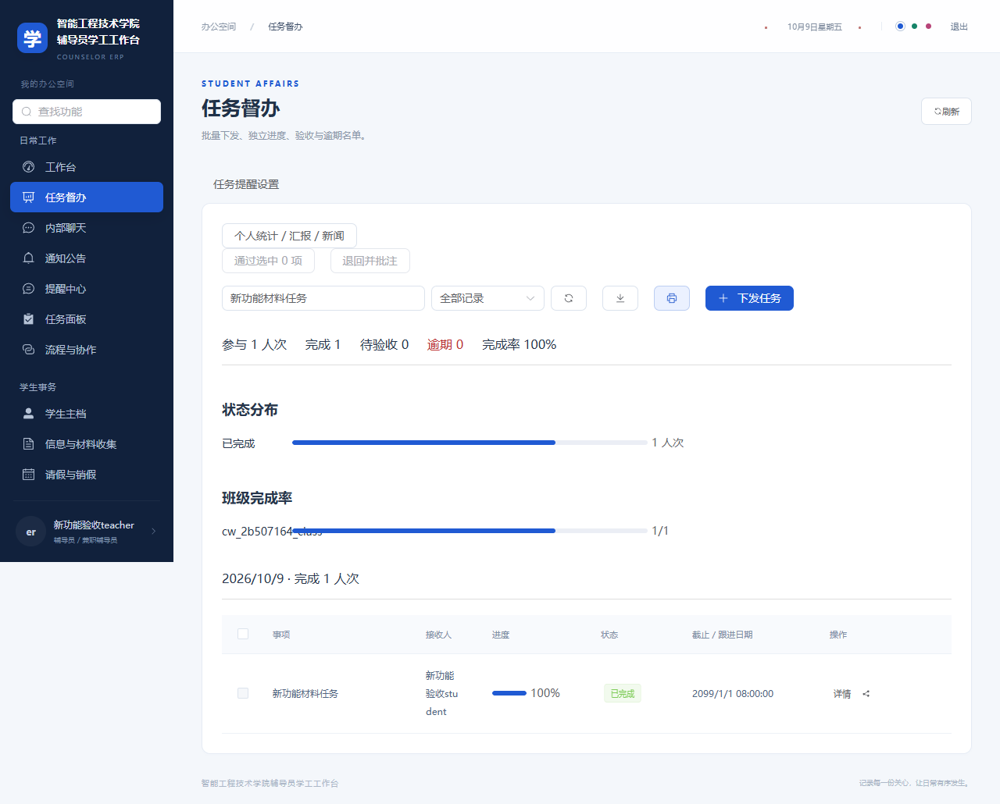
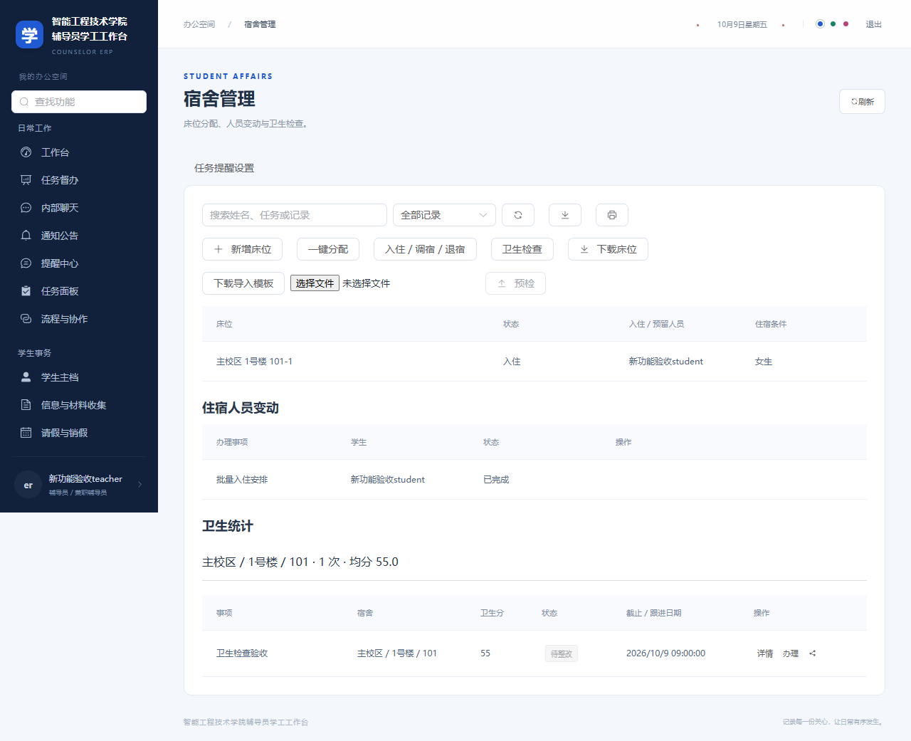
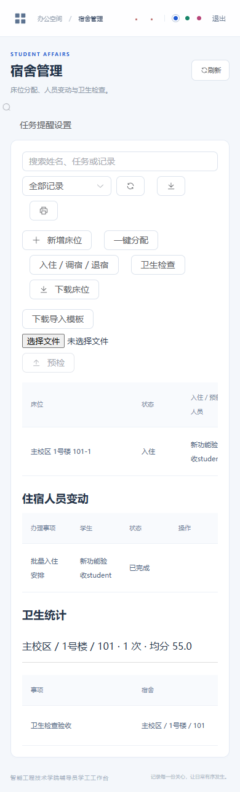
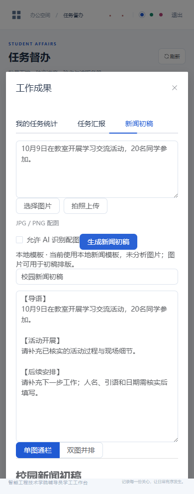

# Counselor Workflow System · 辅导员工作流系统

> A readable, sanitized case study of a role-based student-affairs workflow interface.
>
> 面向辅导员日常事务的角色化工作流展示项目，聚焦结构化记录、提醒、知识检索与跨端阅读体验。

[Open the online showcase](https://guhang2011.github.io/counselor-workflow-showcase/) · [View the profile](https://github.com/GuHang2011)

## What this repository shows

This repository is a **portfolio selection**, prepared from a larger local Vue + Spring Boot application. It shows the parts that are useful for a reviewer to inspect quickly:

- role-aware navigation and task-oriented information architecture;
- explicit request states, ownership and handoff semantics;
- API contract examples that require endpoint-level server deduplication before retrying writes;
- a flat visual system for dense administrative interfaces;
- screenshot evidence from a clean test login screen and responsive task, dormitory and news layouts;
- a public-safe view of report generation, file review and account-state design.

It is intentionally small. The production-oriented repository, database, uploads, logs, deployment secrets and internal requirements are not included.

## 阅读路径

1. 先打开在线展示页，切换角色和模块，并放大查看登录页截图。
2. 阅读 [`src/workflow-state.ts`](src/workflow-state.ts)，了解前端如何表达待处理、转介、补正和办结状态。
3. 阅读 [`docs/architecture.md`](docs/architecture.md)，了解从界面到服务端的责任边界。
4. 查看 [`docs/reading-notes.md`](docs/reading-notes.md)，延伸到前端状态、数据质量、可访问性和弱网重试。

## Scope and privacy

- Screenshots are actual blank login screens from the local application. They show interface branding and empty fields, with no student records or entered credentials.
- Task labels, counters and identifiers in the static showcase are synthetic.
- No real student name, student number, phone number, email address, attachment, database, token, password or private deployment setting is published here.
- The code is a curated teaching and portfolio sample; it is not a complete deployable copy of the original system.

## Recent interface evidence

These screenshots come from isolated test data and contain no real student records or credentials.

| Screen | Desktop | Mobile |
| --- | --- | --- |
| Task dashboard and progress |  | — |
| Dormitory allocation and hygiene |  |  |
| AI-assisted news draft layout | — |  |

The underlying application now supports personal task statistics, text and editable PPT reports, optional AI news drafting with image layout, multi-review with rejection comments, administrator time extensions, file-required tasks, and account states with forced initial password changes. The public showcase remains static and deliberately excludes those production credentials and data paths.

## Run the static showcase locally

With Python 3 installed, run this from the repository root:

```sh
python -m http.server 8080 --bind 127.0.0.1
```

Open <http://127.0.0.1:8080/>. The page uses plain HTML, CSS and JavaScript. No login, database, build step or backend is required. Role and module buttons change example text; they do not enforce authorization or submit real requests.

The two standalone TypeScript files in `src/` are domain/API teaching examples, not a backend or a connected part of the page. Run the contract checks with Node.js 22.18+ (or Node.js 24+):

```sh
node --test tests/contracts.test.mjs
```

## Original application context

The larger local application uses Vue, TypeScript and Spring Boot. This public repository contains a **new static presentation and small illustrative extracts**, not the full application or its dependencies. The login screenshots document the source interface only; they do not demonstrate deployment, load capacity or user impact.

## Evidence

| Evidence | What to inspect |
| --- | --- |
| Online showcase | Role switcher, module selector and screenshot lightbox |
| Workflow model | State transitions, owner-only actions, explicit transfer target and version checks in `src/workflow-state.ts` |
| Retry contract | A stable key plus explicit endpoint deduplication support in `src/api-contract.ts` |
| Contract checks | Transfer, ownership, conflict and retry failure cases in `tests/contracts.test.mjs` |
| Architecture note | UI, API, domain and audit boundaries in `docs/architecture.md` |
| Screenshots | Clean desktop and mobile login states in `assets/` |

## Attribution boundary

The showcase describes engineering practice and interface design. It does not claim ownership of institutional data or disclose confidential implementation details.
